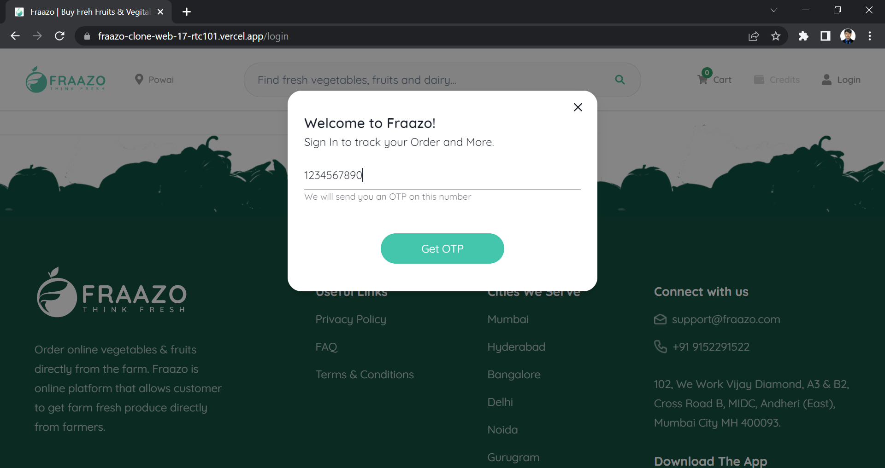
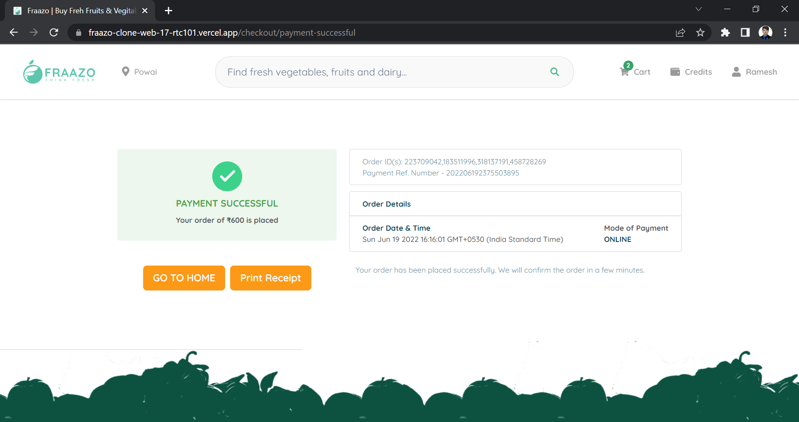

# “Fraazo.com” Website Clone


### Fraazo is the online online store to buy fresh fruits and vegetables, herbs and dry fruits.

This project is about building a web application to buy wide variety of fresh fruits and vegetables. It have some cool features like save the data in redux-store and session-storage to reduce the dependency of network requests, toast notification for every action, pop up modal to display extra details and responsive for every screen size.

## Technologies we used

[-20232A?style=for-the-badge&logo=react&logoColor=61DAFB>)](https://reactjs.org/)

[-593D88?style=for-the-badge&logo=redux&logoColor=white>)](https://redux.js.org/)

[](https://chakra-ui.com/)

[](https://www.npmjs.com/package/json-server)

[](https://styled-components.com/)

## 🚀 Features

- Login/Signup User Account
- Searching product with Debouncing feature
- Cart Add/Remove Items
- Pop modal and Toast notification
- Cart Update Quantities
- Payment page which calculates the products prices dynamically.
- Address Management
- Order Summary
- Coupons are provided for the discount
- Order details of all ordered item

## 🚀 Our Team Members:-

- Ramesh [[LinkedIn Profile](https://www.linkedin.com/in/ramesh-mane-268a0014a/)]

- Shriram [[LinkedIn Profile](https://www.linkedin.com/in/shriram-deshpande-477590136/)]

- Sarbjot Singh [[LinkedIn Profile](https://www.linkedin.com/in/sarbjot-/)]

- shubham barore [[LinkedIn Profile](https://www.linkedin.com/in/shubham-barore-572738159)]

- Pratik Mate [[LinkedIn Profile](https://www.linkedin.com/in/pratik-mate-a6a62919b)]

- Thanigaivel Ambalavanan [[LinkedIn Profile](https://www.linkedin.com/in/thanigaivel-ambalavanan-3b4a30120/)]

## Screenshots

#### Homepage -

This is the main landing page of our website. Here clicking on any option on the Navbar and Images will redirect the user to the respective Product Page.

This page is functional and responsive.


#### Navigation bar -

If the user clicks on the SignUp/login page it shows the pages of that section and also Searching of product with debouncing feature.


#### Sign up / Sign in Page -

On this page, you can register a user. If the user is already registered, you can simply sign in by providing valid details of the user.



#### Products Page -

Here users can browse and add items to the cart by clicking on the Add to Cart button.


#### Cart Page -

Here all the products added to the cart will be shown. On this page, you can also remove the items. By clicking on the “CHECKOUT” button you will be redirected to the checkout page.


#### Payment Page -

On this page, users can add their address details and add their payment details.

By providing these details users can place orders by clicking the “PLACE ORDER” button.


After Proceeding users get will get OTP page


If user entered correct OTP it will redirect to payment succefull page or elese it entered wrong it will get error as wrong OTP



After Payment Success you will be redirected to the Home Page.

In case you clicked on cancel on OTP Page it will redirect to this page.


## Run Locally

Clone the project

```bash
  git clone https://github.com/shriram083/Fraazo-Clone.git
```

Go to the project directory

```bash
  cd Fraazo-Clone
```

Install dependencies

```bash
  npm install
```

Start the localhost server

```bash
  npm start
```

Start the local API server

```bash
  json-server --watch data.json --port 8080
```

## Or refer any one deployed link

### Netlify Link

[https://fraazo-clone-web-17.netlify.app/](https://fraazo-clone-web-17.netlify.app/)

### Vercel Link

[https://fraazo-clone-web-17-rtc101.vercel.app//](https://fraazo-clone-web-17-rtc101.vercel.app/)


